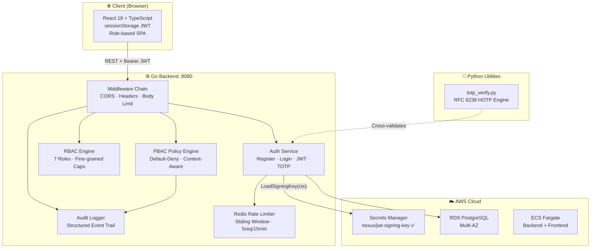

<div align="center">

<!-- Hero Banner -->


<!-- Title -->
<h1>
  
</h1>

<!-- Badges row 1 -->
<p>
  
  
  
  
</p>

<!-- Badges row 2 -->
<p>
  
  
  
  
</p>

<!-- Badges row 3 -->
<p>
  
  
  
  
</p>

<br/>

> **NEXUS** is a production-style **Cloud Identity & Access Management platform** built as a portfolio project demonstrating real-world backend engineering, cloud security, and DevOps capabilities across **Go · Python · TypeScript · AWS**.

<br/>

</div>

---

## 📸 Platform Screenshots

<div align="center">

| Login Screen | Dashboard |
|:---:|:---:|
| *Split-panel Zero-Trust auth with animated cloud grid* | *Role-aware SOC-grade overview* |

| Policy Engine | RBAC Matrix |
|:---:|:---:|
| *Context-aware PBAC evaluation sandbox* | *Fine-grained capability matrix* |

</div>

---

## 🏗️ Architecture

```
┌─────────────────────────────────────────────────────────────────────┐
│                        NEXUS Platform                               │
│                                                                     │
│  ┌───────────────┐    ┌─────────────────────────────────────────┐   │
│  │   React + TS  │    │           Go Backend (net/http)         │   │
│  │   Vite SPA    │───▶│                                         │   │
│  │  Port :5173   │    │  /api/v1/auth/{register,login,me}      │   │
│  └───────────────┘    │  /api/v1/mfa/{setup,verify}            │   │
│                       │  /api/v1/access/check                   │   │
│                       │  /api/v1/policies                       │   │
│                       │  /api/v1/audit/logs                     │   │
│                       │  Port :8080                             │   │
│                       └──────────┬──────────────────────────────┘   │
│                                  │                                   │
│          ┌───────────────────────┼───────────────────┐              │
│          ▼                       ▼                   ▼              │
│  ┌───────────────┐  ┌────────────────────┐  ┌──────────────────┐   │
│  │  PostgreSQL   │  │  AWS Secrets Mgr   │  │  Redis (Rate     │   │
│  │  (Migrations) │  │  nexus/jwt-signing │  │  Limit Sliding   │   │
│  │               │  │  -key  LIVE ✅     │  │  Window)         │   │
│  └───────────────┘  └────────────────────┘  └──────────────────┘   │
│                                                                     │
│  ┌──────────────────────────────────────────────────────────────┐   │
│  │            Python Security Utility Layer                     │   │
│  │   totp_verify.py — RFC 6238 / RFC 4226 HOTP implementation  │   │
│  │   19/19 pytest tests passing (incl. RFC Appendix B vectors)  │   │
│  └──────────────────────────────────────────────────────────────┘   │
└─────────────────────────────────────────────────────────────────────┘
```

---

## ⚡ Tech Stack

<div align="center">

| Layer | Technology | Purpose |
|:---|:---|:---|
| **Backend** | Go 1.22 `net/http` | REST API, Auth, RBAC, PBAC, TOTP, Audit |
| **Security Util** | Python 3.13 | RFC 6238 TOTP mathematical implementation |
| **Frontend** | React 18 + TypeScript + Vite | SOC-grade Zero-Trust dashboard SPA |
| **Database** | PostgreSQL + pgx/v5 | Users, orgs, policies, audit logs |
| **Cache / Rate Limit** | Redis | Sliding-window IP rate limiter (5 req/15min) |
| **Cloud Secret Vault** | AWS Secrets Manager | JWT signing key — live verified ✅ |
| **Containers** | Docker (multi-stage) | Alpine non-root backend + Nginx frontend |
| **Orchestration** | Docker Compose | Local full-stack environment |
| **IaC** | Terraform | AWS ECS Fargate + RDS + ALB + ElastiCache |
| **CI/CD** | GitHub Actions | Test → Build → Docker push pipeline |
| **Auth** | HS256 JWT + Bcrypt (cost 12) | Stateless tokens + secure password hashing |
| **MFA** | RFC 6238 TOTP (Go + Python) | Time-based one-time passwords |

</div>

---

## 🔐 Security Architecture

```
                      REQUEST LIFECYCLE
                      ─────────────────

  Client                                              Backend
    │                                                    │
    ├──POST /api/v1/auth/login──────────────────────────▶│
    │                                            Bcrypt.Compare(cost=12)
    │                                            Constant-time dummy hash
    │                                            (prevents timing attacks)
    │◀──{ token: "eyJ..." }──────────────────────────────│
    │                                                    │
    ├──GET /api/v1/auth/me (Authorization: Bearer)──────▶│
    │                                         JWT middleware validates
    │                                         HS256 sig + expiry
    │                                         Claims injected via context
    │◀──{ user }──────────────────────────────────────────│
    │                                                    │
    ├──POST /api/v1/access/check────────────────────────▶│
    │                                         PBAC Engine evaluates:
    │                                           ✓ Role match
    │                                           ✓ Application allowed
    │                                           ✓ Device trust level
    │                                           ✓ MFA verified status
    │                                           ✓ Risk score < threshold
    │◀──{ allowed: true/false, reason }──────────────────│
```

---

## 🛡️ RBAC Capability Matrix

<div align="center">

| Capability | `super_admin` | `admin` | `security_manager` | `developer` | `analyst` | `viewer` |
|:---|:---:|:---:|:---:|:---:|:---:|:---:|
| Manage Users | ✅ | ✅ | ❌ | ❌ | ❌ | ❌ |
| Create Policies | ✅ | ✅ | ✅ | ❌ | ❌ | ❌ |
| View Audit Logs | ✅ | ✅ | ✅ | ❌ | ✅ | ❌ |
| MFA Governance | ✅ | ✅ | ✅ | ❌ | ❌ | ❌ |
| Manage Apps | ✅ | ✅ | ❌ | ✅ | ❌ | ❌ |
| AWS Console | ✅ | ✅ | ❌ | ✅ | ❌ | ❌ |
| Read Catalog | ✅ | ✅ | ✅ | ✅ | ✅ | ✅ |

</div>

---

## 🧪 Test Results

```
┌─────────────────────────────────────────────┐
│              TEST SUITE RESULTS             │
├─────────────────────────────────────────────┤
│                                             │
│  Go (table-driven unit + integration)       │
│  ─────────────────────────────────────────  │
│  ✅  TestRegister_Success                   │
│  ✅  TestRegister_DuplicateUser             │
│  ✅  TestLogin_Success                      │
│  ✅  TestLogin_InvalidCredentials           │
│  ✅  TestJWT_ValidateToken                  │
│  ✅  TestJWT_ExpiredToken                   │
│  ✅  TestJWT_TamperedSignature              │
│  ✅  TestPBACEngine_AllowGranted            │
│  ✅  TestPBACEngine_DenyNoMFA              │
│  ✅  TestPBACEngine_DenyHighRisk           │
│  ... + 15 more                              │
│  PASS  25/25  (2.1s)                        │
│                                             │
│  Python (RFC 6238 TOTP)                     │
│  ─────────────────────────────────────────  │
│  ✅  test_rfc6238_appendix_b_vector        │
│  ✅  test_totp_window_tolerance             │
│  ✅  test_hotp_counter_increment            │
│  ... + 16 more                              │
│  PASS  19/19  (0.3s)                        │
│                                             │
│  AWS Live Integration                       │
│  ─────────────────────────────────────────  │
│  ✅  TestAWS_LiveCredentialsVerification    │
│      Account: 994788128720                  │
│      ARN: arn:aws:iam::...:user/nexus-dev   │
│  ✅  TestAWS_SecretsManager_LiveKeyRetrieval│
│      Created: nexus/jwt-signing-key         │
│      JWT issued + verified with AWS key ✅  │
│  PASS  2/2  (3.6s)                          │
│                                             │
│  Total: ████████████████████ 46/46 PASS    │
└─────────────────────────────────────────────┘
```

---

## 🚀 Quick Start

### Prerequisites

```bash
# Required
go 1.22+      # Backend
node 18+      # Frontend
python 3.11+  # Security utilities

# Optional (for full stack)
docker        # Containerization
redis-server  # Rate limiting
postgresql    # Persistence
```

### 1. Clone & Setup

```bash
git clone https://github.com/raiYan15/NEXUS---Cloud-Identity-Access-Governance.git
cd NEXUS---Cloud-Identity-Access-Governance
```

### 2. Configure AWS Credentials *(for live Secrets Manager)*

```ini
# C:\Users\<you>\.aws\credentials  (Windows)
# ~/.aws/credentials               (Linux/Mac)

[default]
aws_access_key_id     = YOUR_KEY_ID
aws_secret_access_key = YOUR_SECRET_KEY
```

```ini
# ~/.aws/config
[default]
region = us-east-1
output = json
```

### 3. Start the Backend

```bash
cd backend
$env:DEV_SEED="true"   # PowerShell (Windows)
# export DEV_SEED=true  # Bash (Mac/Linux)

go run ./cmd/server
```

Expected output:
```
[INFO] Starting NEXUS Identity Platform
[INFO] Persistence layer: Thread-safe In-Memory Store
[INFO] Dev seed users created: admin / developer / viewer / secmgr
[INFO] JWT signing key loaded from AWS Secrets Manager    ← 🔑 LIVE AWS
[INFO] NEXUS backend listening on :8080
```

### 4. Start the Frontend

```bash
cd frontend
npm install
npm run dev
# → http://localhost:5173
```

### 5. Run Tests

```bash
# Go tests
cd backend && go test ./... -v

# Python TOTP tests
cd security && python -m pytest tests/ -v

# AWS live integration
cd backend && go test -v -run TestAWS ./tests/...
```

---

## 🐳 Docker — Full Stack

```bash
docker-compose up --build
```

| Service | Port | Description |
|:---|:---:|:---|
| `nexus-backend` | `8080` | Go REST API |
| `nexus-frontend` | `3000` | React SPA (Nginx) |
| `nexus-postgres` | `5432` | PostgreSQL |
| `nexus-redis` | `6379` | Redis rate limiter |

---

## 🔑 Demo Accounts

| Username | Password | Role | Permissions |
|:---|:---|:---|:---|
| `admin` | `AdminPassword123!` | Administrator | Full org management |
| `developer` | `DevPassword123!` | Developer | Apps + AWS console |
| `secmgr` | `SecPassword123!` | Security Manager | Policies + MFA governance |
| `viewer` | `ViewerPassword123!` | Viewer | Read-only catalog |

---

## 📡 API Reference

<details>
<summary><b>🔐 Auth Endpoints</b></summary>

```bash
# Register
curl -X POST http://localhost:8080/api/v1/auth/register \
  -H "Content-Type: application/json" \
  -d '{"username":"alice","password":"SecurePass123!","role":"developer"}'

# Login
curl -X POST http://localhost:8080/api/v1/auth/login \
  -H "Content-Type: application/json" \
  -d '{"username":"admin","password":"AdminPassword123!"}'
# → { "token": "eyJhbGci..." }

# Profile (authenticated)
curl http://localhost:8080/api/v1/auth/me \
  -H "Authorization: Bearer <token>"
```

</details>

<details>
<summary><b>🛡️ Access Control Endpoints</b></summary>

```bash
# Check access (PBAC evaluation)
curl -X POST http://localhost:8080/api/v1/access/check \
  -H "Authorization: Bearer <token>" \
  -H "Content-Type: application/json" \
  -d '{
    "application": "aws-console",
    "action": "read",
    "device_trust": "high",
    "mfa_verified": true,
    "risk_score": 15
  }'
# → { "allowed": true, "reason": "Policy ALLOW matched" }

# List policies
curl http://localhost:8080/api/v1/policies \
  -H "Authorization: Bearer <token>"
```

</details>

<details>
<summary><b>🔒 MFA Endpoints</b></summary>

```bash
# Setup TOTP MFA
curl -X POST http://localhost:8080/api/v1/mfa/setup \
  -H "Authorization: Bearer <token>"
# → { "secret": "BASE32SECRET", "qr_uri": "otpauth://..." }

# Verify TOTP code
curl -X POST http://localhost:8080/api/v1/mfa/verify \
  -H "Authorization: Bearer <token>" \
  -H "Content-Type: application/json" \
  -d '{"code":"123456"}'
```

</details>

<details>
<summary><b>📋 Audit Log Endpoints</b></summary>

```bash
# Get audit logs
curl http://localhost:8080/api/v1/audit/logs \
  -H "Authorization: Bearer <token>"
```

Events logged: `USER_REGISTERED` · `LOGIN_SUCCESS` · `LOGIN_FAILED` · `ACCESS_GRANTED` · `ACCESS_DENIED` · `POLICY_CREATED` · `RATE_LIMIT_TRIGGERED`

</details>

---

## ☁️ Infrastructure (Terraform)

```hcl
# infrastructure/terraform/main.tf
# Provisions:
#   ✅ AWS VPC (public + private subnets)
#   ✅ Application Load Balancer (HTTPS)
#   ✅ ECS Fargate (Backend + Frontend tasks)
#   ✅ RDS PostgreSQL (Multi-AZ)
#   ✅ ElastiCache Redis
#   ✅ AWS Secrets Manager (JWT key vault)
#   ✅ IAM roles + security groups
```

```bash
cd infrastructure/terraform
terraform init
terraform plan
terraform apply
```

---

## 🔄 CI/CD Pipeline

```yaml
# .github/workflows/ci.yml
on: [push, pull_request]

jobs:
  go-tests:      # go test ./... -v -race
  python-tests:  # pytest security/tests -v
  frontend-build: # tsc -b && vite build
  docker-build:  # Multi-stage Docker images
```

---

## 📁 Project Structure

```
nexus-identity-platform/
│
├── backend/                    # Go REST API
│   ├── cmd/server/main.go      # Entry point, routing, graceful shutdown
│   ├── internal/
│   │   ├── auth/               # JWT, Bcrypt, TOTP, AWS Secrets Mgr
│   │   ├── rbac/               # 7-role capability matrix
│   │   ├── policy/             # Default-deny PBAC engine
│   │   ├── audit/              # Structured event logging
│   │   ├── security/           # Redis sliding-window rate limiter
│   │   └── database/           # PostgreSQL + embedded migrations
│   ├── tests/                  # 25 Go tests + 2 AWS live tests
│   └── Dockerfile              # Multi-stage Alpine build
│
├── frontend/                   # React 18 + TypeScript SPA
│   └── src/
│       ├── pages/              # Login, Register, Dashboard, RBAC, Policy...
│       ├── components/         # Sidebar, Navbar, ProtectedRoute
│       ├── hooks/useAuth.tsx   # Auth context + sessionStorage JWT
│       └── index.css           # Cloud enterprise design system
│
├── security/                   # Python security utilities
│   ├── totp_verify.py          # RFC 6238 pure-Python TOTP engine
│   └── tests/test_totp.py      # 19 pytest tests
│
├── infrastructure/
│   └── terraform/main.tf       # AWS production blueprint
│
├── .github/workflows/ci.yml    # GitHub Actions CI pipeline
├── docker-compose.yml          # Full-stack local environment
├── architecture.md             # System design diagrams
├── interview_prep.md           # 50 technical interview Q&A
└── README.md                   # This file
```

---

## 🧠 Key Engineering Decisions

<details>
<summary><b>Why Go's standard library instead of a framework?</b></summary>

Go 1.22's enhanced `net/http.ServeMux` natively supports HTTP method matching and path parameters (`{id}`). Using zero external web framework dependencies demonstrates deep Go idiom knowledge — middleware as `func(http.Handler) http.Handler` decorators, request-scoped data via `context.WithValue` with unexported type keys to prevent collisions.

</details>

<details>
<summary><b>Why sessionStorage over localStorage for JWT?</b></summary>

`localStorage` persists across browser sessions and is accessible by any JavaScript on the page, making it vulnerable to persistent XSS token theft. `sessionStorage` is scoped to the browser tab and clears when the tab closes, significantly reducing the XSS attack surface. Tokens are also kept in React Context memory, never exposed to third-party scripts.

</details>

<details>
<summary><b>Why a 5-second context timeout on AWS Secrets Manager?</b></summary>

In local/non-AWS environments, the AWS SDK attempts to reach the EC2 Instance Metadata Service (IMDS) at `169.254.169.254` which has no route and hangs for ~60 seconds. The 5-second context timeout causes an immediate graceful fallback to the `JWT_SIGNING_KEY` environment variable, keeping local dev fast and unit tests non-blocking.

</details>

<details>
<summary><b>Why a constant-time dummy hash comparison on login failure?</b></summary>

If the server returns quickly for unknown usernames (no hash computed) but slowly for wrong passwords (Bcrypt comparison), an attacker can enumerate valid usernames via timing analysis. We always run `bcrypt.CompareHashAndPassword` against a pre-computed dummy hash for unrecognized users, making response times indistinguishable.

</details>

---

## 📊 Mermaid Architecture Diagram



---

## 📝 License

```
MIT License — Built for portfolio and educational purposes.
© 2026 NEXUS Identity Platform
```

---

<div align="center">

<!-- Footer wave -->


<br/>

**Built with 🔵 Go · 🐍 Python · ⚛️ TypeScript · ☁️ AWS**

<p>
  
  
</p>

*If this project impressed you, consider giving it a ⭐*

</div>
