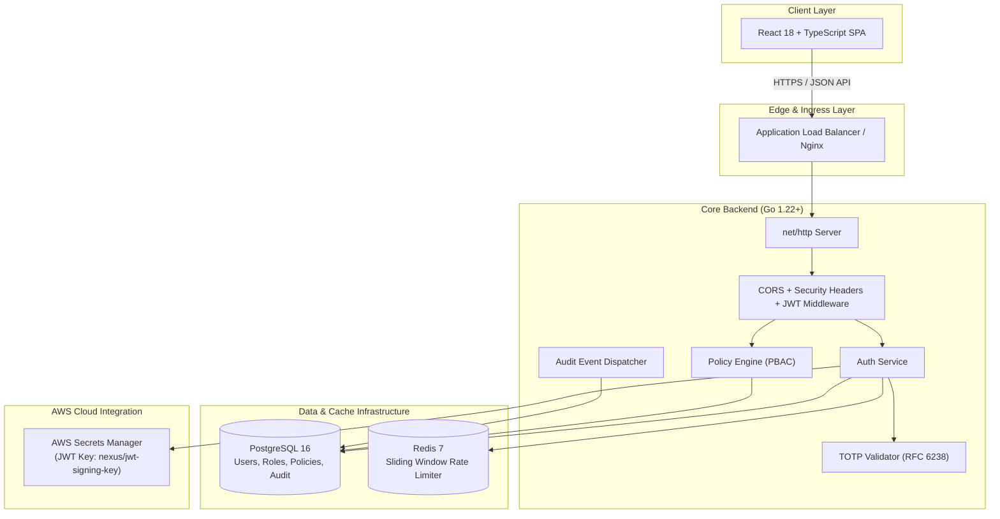

# NEXUS — Cloud Identity & Access Platform Architecture

## 1. System Overview & Access Pipeline

NEXUS implements a defense-in-depth, zero-trust cloud identity and policy engine designed to govern resource access across distributed cloud infrastructure.

```text
                               +----------------------------------------+
                               |              INBOUND USER              |
                               +----------------------------------------+
                                                   |
                                                   v
                               +----------------------------------------+
                               |          AUTHENTICATION LAYER          |
                               |    • Bcrypt Password Verification      |
                               |    • Rate Limiting (Redis 5 attempts)  |
                               +----------------------------------------+
                                                   |
                                                   v
                               +----------------------------------------+
                               |          JWT CLAIMS ISSUANCE           |
                               |   • Signed via HS256                   |
                               |   • Secret from AWS Secrets Manager    |
                               +----------------------------------------+
                                                   |
                                                   v
                               +----------------------------------------+
                               |         MFA EVALUATION (TOTP)          |
                               |   • RFC 6238 / RFC 4226 dynamic offset |
                               |   • HMAC-SHA1 + Base32 Secret          |
                               +----------------------------------------+
                                                   |
                                                   v
                               +----------------------------------------+
                               |        RBAC CAPABILITY MATRIX          |
                               |   • Fine-grained permission checks     |
                               +----------------------------------------+
                                                   |
                                                   v
                               +----------------------------------------+
                               |     POLICY ENGINE (PBAC EVALUATION)    |
                               |   • Device Trust + Risk Score Analysis |
                               +----------------------------------------+
                                                   |
                                                   v
                          +--------------------------------------------------+
                          |                 ACCESS DECISION                  |
                          |        [ ALLOW  /  DENY  /  REQUIRE_MFA ]        |
                          +--------------------------------------------------+
                                                   |
                                                   v
                               +----------------------------------------+
                               |          AUDIT EVENT LOGGING           |
                               |   • PostgreSQL immutable audit records |
                               +----------------------------------------+
```

---

## 2. Mermaid Architecture Diagram



---

## 3. Technology Stack & Design Decisions

| Component | Technology | Rationale & Tradeoffs |
|---|---|---|
| **Core Backend** | Go (`net/http`) | High throughput, memory safety, explicit concurrency, fast startup time. No bulky frameworks. |
| **JWT Engine** | `golang-jwt/jwt/v5` | Industry-standard RFC 7519 HMAC-SHA256 token verification with expiration and issuer validation. |
| **Password Hashing** | `golang.org/x/crypto/bcrypt` | Adaptive cost factor 12 prevents rainbow-table and GPU-accelerated brute force attacks. |
| **Security Utility** | Python 3 | Independent RFC 6238 implementation from mathematical first principles (HOTP, dynamic truncation). |
| **Persistent Store** | PostgreSQL 16 | ACID-compliant relational schemas with indexed audit log querying and JSONB metadata storage. |
| **Rate Limiter** | Redis 7 | Atomic pipeline operations (`INCR` + `EXPIRE`) providing distributed protection against brute force. |
| **Cloud Secrets** | AWS Secrets Manager (v2 SDK) | Dynamic retrieval of signing keys; decouples cryptographic secrets from code and environment variables. |
| **Frontend** | React 18 + TypeScript + Vite | Type-safe single-page application with responsive dark SOC security theme and zero localStorage risk. |
